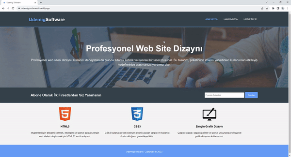

<h1>udemig-site</h1>

I designed a project on the theme of website development. You can switch to the project page by clicking on navigation fields such as "about us" and "services". You can create a subscription with the subscribe button

<h2> Technologies I Use </h2>

I designed my project with HTML5 and CSS3 codes.

<h2>Screenshot</h2>

